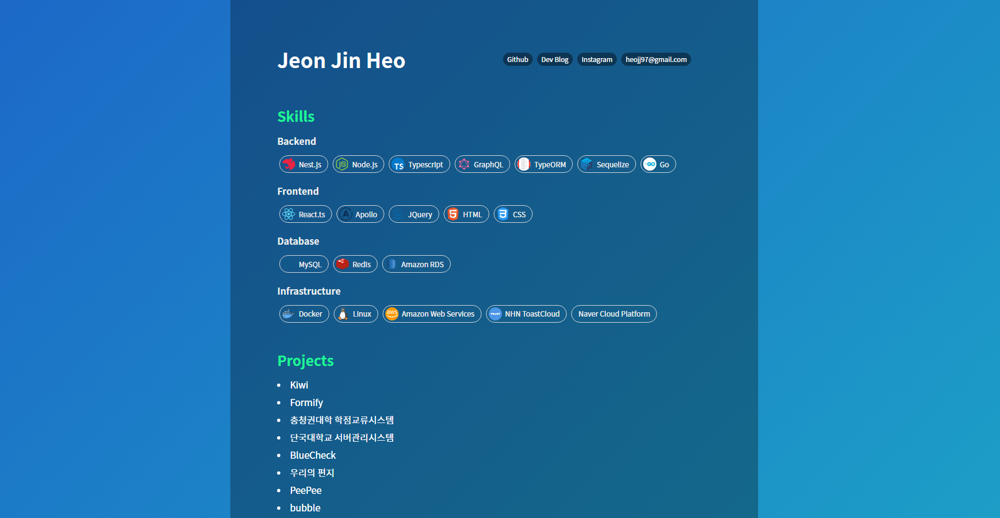

# zini-profile2

new version of [zini-profile](https://github.com/zinirun/zini-profile)




## Create yours

- Clone this repo
  ```bash
  git clone https://github.com/zinirun/zini-profile2.git
  ```
- modify your profile in `/src/configs/profile.ts`
  - can customize view in `/src/App.js`
- Production
  - Simply use [netlify](https://www.netlify.com/) to product react-app
  - use docker
    - modify `./nginx.conf` and `./init-letsencrypt.sh` with your domain
    - execute `./init-letsencrypt.sh` to do docker-compose up